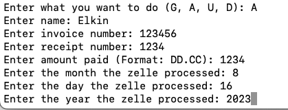

# Transaction Tracker (Python & NoSQL)

Transaction Tracker is a Python project that allows users to manage transactions in a MongoDB or Cloud Firestoredatabase. 

## Table of Contents

1. [Installation](#installation)
2. [Configuration](#configuration)
3. [Prerequisites](#prerequisites)
4. [Usage](#usage)
5. [Features](#features)
6. [Screenshot](#screenshots)
7. [Contact Information](#contact-information)
8. [Acknowledgments](#acknowledgments)
8. [Roadmap](#roadmap)

## Installation
To set up and install the project, follow these steps:

- Install the `pymongo` library: 
`pip install pymongo`
- Install the `bson` library:
`pip install bson`
- Install the `firebase-admin` library:
`pip install --upgrade firebase-admin`

## Configuration

- Create & configure the `.ini` file with sensitive information such as local database connection details.

- Create & configure the `keys/credentials.json` file with sensitive information such as cloud database connection details.

## Prerequisites

Before running the project, ensure you have the following prerequisites:

- [ ] `pymongo` installed
- [ ] `bson` installed
- [ ] `.ini` file created & configured
- [ ]  `keys/credentials.json` file created & configured

## Usage

### Development

1. Run `python3 main.py` in the command line to start using the Transaction Tracker:

2. Use key inputs to access different features in program:  
 `G`: for retrieving transactions  
 `A`: for adding transactions  
 `U`: for updating transactions  
 `D`: for deleting transactions  

3. Follow the rest of the program instructions to execute commands

## Features

- Easily manage transactions from command line: Add, update, delete, and retrieve transactions in a MongoDB or Cloud Firestore database.
- Prevent duplicate postings: Communicate with the MongoDB or Cloud Firestore database to avoid duplicate transactions.
- Efficient tracking: Track and manage posted transactions for better financial management.

### Screenshot

## Contact Information

For questions, feedback, or inquiries, feel free to contact me at elkingarcia.11@gmail.com or connect with me on [LinkedIn](https://www.linkedin.com/in/elkingarcia11/)

## Acknowledgments

This project utilizes [PyMongo](https://pymongo.readthedocs.io/), a Python distribution containing tools for working with MongoDB.

## Roadmap

The Transaction Tracker project served as the blueprint for the Transaction Tracker API program I developed allowing our operations team to track the company's financial activities from their phones.
